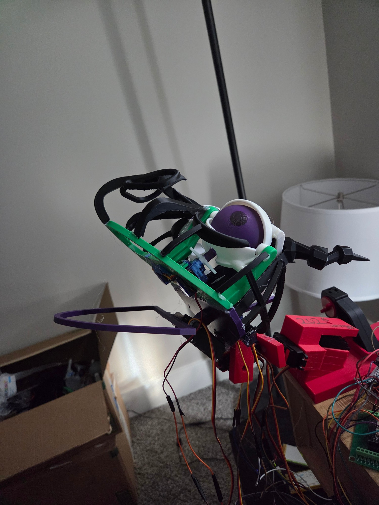
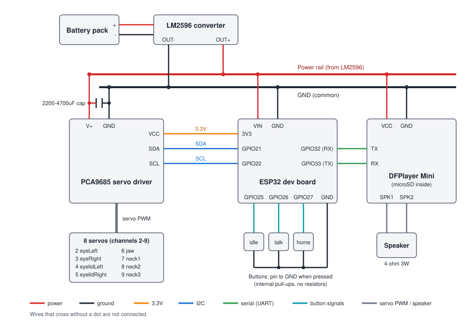

# Dragon

Terry is an animatronic Terrible Terror (from *How to Train Your Dragon*): a dragon head with moving eyes, eyelids, a jaw, and a three-segment neck, plus a speaker for sound.

**What it does:** an ESP32 drives 8 servos through a PCA9685 driver board and plays dog-voiced sound clips from a DFPlayer Mini. It can run scripted animations (roars, head tilts, yawns, sniffs), sound-synced animations whose jaw and neck motion is generated from the recording's volume, and three physical modes: **idle** (ambient sway, blinking and random silent gestures), **talk** (idle plus barking and roaring), and **home** (sits still at rest). Three buttons switch between them.

**Why I made it:** I wanted a dragon that feels alive rather than one that just replays canned motions, so most of the work went into smoothing the movement and syncing the jaw to real audio.



- Bill of materials: [`BOM.csv`](BOM.csv)
- CAD (Onshape link and STEP export): [`CAD/`](CAD/)
- Wiring: see [Wiring](#wiring) below

## Repository layout

- [`BOM.csv`](BOM.csv) — bill of materials.
- [`CAD/`](CAD/) — Onshape link and the STEP assembly export.
- [`firmware/`](firmware/dragon_servos_15/dragon_servos_15.ino) — the current sketch (`firmware/dragon_servos_15/dragon_servos_15.ino`), the latest version.
- [`archive/`](archive/) — superseded versions 1–13, kept for history.
- [`experiments/`](experiments/) — one-off test sketches not part of the main dragon build.
- [`notes/`](notes/) — earlier code drafts and scratch notes saved as `.txt`.
- [`sounds/`](sounds/) — dog-voiced audio takes referenced by sound-synced animations in the sketch.

## How to build Terry

This order works best: print the head, wire the power side, wire the signals, prepare the SD card, flash the firmware, and only then fit the servos. Test after each stage.

### 1. Gather the parts and print the head

Everything you need is in [`BOM.csv`](BOM.csv). You'll also want a multimeter and a USB cable for the ESP32.

Print the head pieces from [`CAD/dragon-head-all-pieces.stl`](CAD/dragon-head-all-pieces.stl). The Onshape document linked in [`CAD/`](CAD/) shows how the pieces fit together.

### 2. Wire the power side

1. Connect the battery pack to the LM2596's input. **Before connecting anything else to it**, turn its adjustment screw until a multimeter reads about 5V on the output.
2. That output is the shared power rail. It feeds the PCA9685's `V+`, the DFPlayer's `VCC`, and the ESP32's `VIN` pin (not `VN` or `3V3`). Join all the grounds together.
3. Put a 2200-4700uF, 25V capacitor across the PCA9685's `V+` and `GND` (long leg to `V+`). Without it, several servos starting at once can brown out the rail and the jaw servo loses its torque.
4. Power the PCA9685's logic `VCC` from the ESP32's `3V3` pin, **not** from the rail. If your board has a jumper linking `VCC` and `V+`, remove it.

### 3. Wire the signals

Follow the [wiring diagram](#wiring): I2C to the PCA9685 (`GPIO21` SDA, `GPIO22` SCL), the DFPlayer's `TX`/`RX` to `GPIO32`/`GPIO33`, and the three mode buttons to `GPIO25`/`26`/`27`, each with its other leg to `GND`. Plug the servos into PCA9685 channels 2-9 as listed in the table under [Wiring](#wiring).

### 4. Prepare the SD card

Format a microSD card as FAT32, create a folder named `mp3` in its root, and copy these clips from [`sounds/`](sounds/) into it under their four-digit names:

| File in `sounds/` | Name on the SD card | Played by |
|---|---|---|
| `clip_01.mp3` | `0001.mp3` | `clip1` |
| `clip_05.mp3` | `0005.mp3` | `clip5` |
| `clip_17.mp3` | `0017.mp3` | `ror two` |
| `ror_burst.mp3` | `0025.mp3` | `ror` |
| `clip2_02.mp3` | `0026.mp3` | `clip2_02` |

The other files in `sounds/` (`clip_11.mp3`, `ror_two.mp3`) are older clips no animation uses any more.

### 5. Flash the firmware

Install [VS Code](https://code.visualstudio.com/) with the PlatformIO extension, then open this folder. In [`platformio.ini`](platformio.ini), change `upload_port` and `monitor_port` from `COM8` to your ESP32's serial port. Then run `pio run -t upload` (see [Building](#building) below). Close any open serial monitor first, or the upload can't reach the port.

Open the Serial Monitor at 9600 baud. On boot Terry should snap every servo to its home position and print `DFPlayer ready.`

### 6. Fit the servos

Now that the electronics work, type `home` so every servo sits at 90 degrees. Attach each servo horn as close to centered as you can and mount the servos in the head. Fix any small leftover offset in software with that servo's `trim` in `servoConfigs[]` (see [Wiring](#wiring)) rather than re-seating the horn. If a servo binds at either end of its travel, narrow its safe range in the same table.

### 7. Test it

- `test1` runs every animation in sequence.
- `play 1` plays a track directly, to check the audio.
- `buttons` prints the raw state of the three button pins, to check their wiring.
- `stress test` moves all eight servos at once, the worst case for the power rail.
- `scan` wiggles each PCA9685 channel in turn, if a servo doesn't respond.

Then try the three buttons: **idle** (ambient sway and silent gestures), **talk** (idle plus barking and roaring), and **home** (sits still).

### If something goes wrong

- **No servo moves at all:** check the PCA9685's `VCC` is on the ESP32's `3V3`, not on the battery rail. This exact mistake caused a long debugging session.
- **A servo (usually the jaw) goes limp when several move at once:** the power rail is browning out. Check the bulk capacitor is installed the right way round, and use `stress test` to reproduce it.
- **`DFPlayer not found`:** check the `TX`/`RX` wires, that the SD card is FAT32 with an `mp3` folder, and that the DFPlayer's `VCC` is on the rail.
- **Upload fails because the port is busy:** close the serial monitor (including VS Code's PlatformIO monitor tab) and try again.
- **A button never does anything:** you probably wired two legs from the same side of the 4-leg button. Use one leg from each side, and check it with `buttons`.

## Building

The current sketch is set up as a [PlatformIO](https://platformio.org/) project (`platformio.ini` at the repo root, pointing at `firmware/dragon_servos_15/` as the source). PlatformIO IDE is installed as a VS Code extension for day-to-day editing, and the `pio` CLI works from this directory for scripted builds:

```
pio run              # compile
pio run -t upload    # compile and flash to the ESP32
pio device monitor    # open the serial monitor at 9600 baud
```

The sketch originally ran on an Arduino Uno; it was migrated to an ESP32 (see the version history below) for far more flash/RAM headroom, more GPIO for the physical mode buttons, and a free hardware UART for the DFPlayer instead of `SoftwareSerial`. The Uno version (and its `platformio.ini`) is still available in git history (commit `fe84b30` and earlier) if ever needed again.

Older sketches in `archive/` and `experiments/` are plain `.ino` files kept for reference — they aren't part of the PlatformIO build and would need their own environment if compiled again.

The sketch briefly gained WiFi + OTA firmware updates (connect at boot, push new code over the air via `ArduinoOTA`), but that was removed again — not currently needed, and the extra WiFi radio activity was one more variable while chasing down hardware issues. It's straightforward to re-add later (git history has the working implementation) if it becomes useful once there's a 2.4GHz network available for it.

## Wiring



The **ESP32 is powered from the same LM2596 rail** as the servos and DFPlayer, through its `VIN` pin (the 5V input to its onboard regulator). Keep the rail at about 5V, never feed it into the `3V3` pin, and avoid having USB plugged in at the same time as the rail. Don't confuse `VIN` with `VN`: `VN` (GPIO39) is a 3.3V-only signal pin, and 5V there can damage the chip.

8 servos, driven through a **PCA9685 PWM driver board over I2C** rather than directly from the microcontroller. Each servo plugs into its own channel on the PCA9685; the microcontroller just sends it angle commands over I2C.

**Why not the `Servo` library directly:** that was the original design (back on the Uno), but `Servo` relies on constant timer interrupts to hold every servo's position, which intermittently collided with `SoftwareSerial`'s interrupts for the DFPlayer — causing a glitch on a random servo after any sound-triggering command, and occasionally dropping the jaw (least torque margin) out entirely. Moving pulse generation to the PCA9685 removes the microcontroller's timers from the picture, so there's nothing left for serial communication to collide with.

**PCA9685 wiring (ESP32):**
- `VCC` → ESP32 `3.3V`, `GND` → ESP32 `GND`, `SCL` → ESP32 `GPIO22`, `SDA` → ESP32 `GPIO21` (logic/I2C side)
- `V+` (a separate screw terminal from the logic `VCC` pin) → the LM2596/battery rail, its `GND` → shared common ground — servos draw real current, so they're powered the same way the DFPlayer is, not from the microcontroller
- Check for a jumper linking `VCC` and `V+` on your specific board and remove it if present — logic and servo power should stay electrically separate
- **`VCC` must actually be 3.3V, not left on a 5V/battery source.** The PCA9685's I2C pins get pulled up to whatever powers its `VCC`, and ESP32 GPIOs are 3.3V-only (not 5V-tolerant) — feeding them a 5V-referenced I2C bus risks damaging those pins over time even if communication appears to work. This exact mistake (VCC wired to the battery rail alongside V+ instead of to the ESP32's 3.3V pin) caused a real "servos won't move" debugging session — worth double-checking directly with a meter if servos ever go completely unresponsive after rewiring.

| Servo | PCA9685 channel | Home angle | Safe range | Trim | Notes |
|---|---|---|---|---|---|
| `eyeLeft` | 2 | 90 | 30–150 | — | |
| `eyeRight` | 3 | 90 | 30–150 | — | |
| `eyelidLeft` | 4 | 90 | 60–120 | — | |
| `eyelidRight` | 5 | 90 | 60–120 | — | |
| `jaw` | 6 | 90 | 15–120 | — | |
| `neck1` | 7 | 90 | 30–150 | — | up/down |
| `neck2` | 8 | 90 | 20–165 | +15° | side-to-side sway |
| `neck3` | 9 | 90 | 30–150 | +10° | side-to-side sway |

Channels, home angles, safe ranges, and trims are all defined in one place at the top of the sketch (`servoConfigs[]`), so rewiring a servo to a different channel or changing its limits doesn't require touching the animation code below it. `trim` corrects small per-servo mechanical differences (e.g. a horn seated slightly off) by nudging the actual PWM output while every animation still just thinks in terms of "90 = centered" — nothing outside `moveServo()` needs to know a trim exists.

If your board's channels aren't numbered, type `scan` into the Serial Monitor: it cycles through channels 0–15, wiggling each one briefly and printing its number, so you can watch which physical connector moves and match it up.

**Mode buttons:** three momentary pushbuttons trigger `idle`/`talk`/`home` without needing the Serial Monitor open. Each one wires between its GPIO and a shared `GND` — no external resistor needed, since the sketch enables the ESP32's internal pull-up on each pin (`INPUT_PULLUP`), so the pin reads HIGH normally and LOW the instant it's pressed. Debouncing is handled in software (`checkModeButtons()`).

| Button | ESP32 pin |
|---|---|
| idle | `GPIO25` |
| talk | `GPIO26` |
| home | `GPIO27` |

Pressing a button while idle/talk mode is already running interrupts it and switches straight to the newly-pressed mode, the same way typing a different command into the Serial Monitor would.

### Controlling it

Open the Serial Monitor at 9600 baud (line ending set to "Newline" or "Both NL & CR"). Commands:

- `<servoName> <angle>` — move one servo directly, e.g. `jaw 60`
- `blink` — synchronized eyelid blink
- `ror` — roar animation (neck drops, jaw opens, eyelids blink, neck sways), paired with [`sounds/ror_burst.mp3`](sounds/ror_burst.mp3) (a short, sharp bark extracted from a longer recording and boosted ~10.5dB, so it only sounds at the very start of the animation rather than filling the whole thing)
- `ror two` — alternate roar: neck/jaw bob through two cycles with a mid-blink, paired with [`sounds/clip_17.mp3`](sounds/clip_17.mp3) (has two real barks of its own, ~510ms apart, landing close to this animation's two mouth-fully-open instants -- no re-editing needed, unlike the original pairing)
- `look right` / `look left` / `front` — eyes and lower neck turn together, or reset to center
- `eyes closed` / `eyes open` — eyelids to fully closed/open
- `tilt` — curious head tilt to a random side (neck2/neck3 lean, eyes glance the same way), no sound
- `yawn` — slow silent yawn/stretch: jaw opens wide, eyelids squint, neck leans back
- `look around` — scanning sweep: eyes/neck to one side, across to the other, back to center, no sound
- `look hold` — turns to a random side and lingers there for 5–12s before returning, unlike `look around`'s quick sweep, no sound
- `chomp` — three quick, shallow jaw snaps, like stretching the jaw, no sound
- `big tilt` — neck2 leans almost to its full safe range (with only a little follow-through on neck3) with a longer hold, no sound
- `look up` — neck cranes upward and holds, like sniffing the air, no sound
- `sleepy` — eyelids ease to a heavy half-closed squint with a slight downward droop, no sound
- `shake` — neck2 swings between its two safe extremes a few times, like a head shake, paced to stay under the speed cap, no sound
- `shake chomp` — eyes close, then neck2 shakes and the jaw does quick little chomps at the same time, like shaking something in its mouth, no sound
- `look down` — neck1 dips down and holds, like sniffing something at ground level, the mirror of `look up`, no sound
- `sniff` — 3–4 quick, shallow head-dip nods, like sniffing the air rapidly, no sound
- `neck roll` — neck2/neck3 sway with a phase offset between them, reading as a rolling stretch rather than a synced lean, no sound
- `double blink` — two quick blinks back to back, like a surprised double-take, no sound
- `clip5` — servo motion generated from [`sounds/clip_05.mp3`](sounds/clip_05.mp3)'s volume envelope (see below)
- `clip1` — same envelope-driven approach as `clip5`, generated from [`sounds/clip_01.mp3`](sounds/clip_01.mp3), but with much bigger and faster neck2/neck3 side-to-side motion (see below)
- `clip2_02` — same envelope-driven approach, generated from [`sounds/clip2_02.mp3`](sounds/clip2_02.mp3) (a longer, 10.2s recording), with even more pronounced neck2/neck3 tilt than `clip1`
- `idle` — ambient idle mode: continuous neck sway, regular blinking, occasional bigger animations and "freeze" pauses, all randomized, no sound (see below); type anything to stop it
- `talk` — same ambient engine as `idle`, but its pool of bigger animations also includes the sound-synced ones (`ror`, `ror two`, `clip5`, `clip1`, `clip2_02`), so the dragon can spontaneously bark/roar on its own instead of only doing silent gestures (see below); type anything to stop it
- `home` — eases every servo to its home angle and holds there, no ambient sway or animations at all -- a deliberate "at rest" state, unlike `idle`/`talk`; also triggerable from its own physical button (see Wiring)
- `buttons` — diagnostic: for 15 seconds, prints the raw state of the three mode-button pins (`1` = released, `0` = pressed), for checking button wiring
- `scan` — diagnostic: cycles PCA9685 channels 0–15, wiggling and announcing each one, for figuring out physical wiring on an unlabeled board
- `stress test` — diagnostic: all 8 servos twitch ±12° around home in sync, back and forth, for as long as it runs -- the worst case for the shared servo power rail (every servo accelerates at once on every direction change), meant for reproducing/metering a power brownout rather than looking natural; type anything to stop it
- `test1` — runs every animation above in sequence, for a quick smoke test after rewiring

### Sound module (DFPlayer Mini)

- DFPlayer TX → ESP32 `GPIO32`, DFPlayer RX → ESP32 `GPIO33` — this is UART2, a real hardware serial port (the ESP32 has three independent UARTs, so unlike the Uno the DFPlayer gets its own dedicated port instead of `SoftwareSerial`). GPIO32/33 were picked over the more "conventional" default RX2/TX2 pins (16/17) because 16/17 double as the PSRAM interface on some ESP32 module variants, which would make them unusable as a UART regardless of external wiring.
- DFPlayer VCC → the LM2596/battery rail (**not** the microcontroller's own power pin — its amp draws more current than a microcontroller's own regulator can reliably supply, and starving it can brown out the whole board)
- DFPlayer GND → shared with the microcontroller and servo ground (all one common ground)
- SD card: FAT32, with an `mp3` folder in the root containing `0001.mp3`, `0002.mp3`, etc. — `playMp3Folder(N)` plays `000N.mp3`
- `play <N>` in the Serial Monitor tests a track directly, independent of any animation

**Speaker:** the stock/bundled speaker that ships with most DFPlayer kits is quiet even at max software volume (`dfPlayer.volume(30)`, already set in the sketch). For a louder upgrade, look for:

- **4Ω impedance** (8Ω also works, but 4Ω lets the onboard amp deliver its full rated output)
- **3W power rating** — matches what the DFPlayer Mini's amp is built to drive
- **40–57mm diameter or larger** — noticeably louder/fuller than the tiny 20–28mm speakers commonly bundled with these kits, at the same wattage
- **Enclosed/housed**, not a bare driver — an enclosure stops the front and back sound waves from canceling out, which matters more for perceived volume than most spec differences
- Mounting it to fire into an enclosed cavity in the head (e.g. behind the mouth) with only a small opening to the outside can meaningfully boost volume for free, similar to an instrument body

If a speaker swap still isn't loud enough, the next step up is a small external amplifier (e.g. a PAM8403-based board) between the DFPlayer's line-level output and the speaker, bypassing the onboard amp's power ceiling entirely.

### Idle mode (and talk mode)

`idleAnimation()` (the `idle` command, or its own physical button — see Wiring) is meant to make the dragon look alive with no operator input and no sound. It layers several independent, randomly-timed behaviors:

- **Ambient sway** — `neck1`/`neck2`/`neck3` sway continuously, each on a different period so the combined motion doesn't look like a robotic uniform wobble.
- **Regular blinking** — every 3–6 seconds, independent of everything else.
- **Bigger animations** — every 10–20 seconds, one of `tilt` / `yawn` / `look around` / `look hold` / `chomp` / `big tilt` / `look up` / `sleepy` / `shake` / `shake chomp` / `look down` / `sniff` / `neck roll` / `double blink` fires, weighted so small/cheap gestures (`tilt`, `look around`, `chomp`, `sniff`) come up far more often than the dramatic ones (`big tilt`, `shake`, `shake chomp`), and never the same one twice in a row. Deliberately excludes "stateful" animations (`eyes closed`, `look right`/`look left`) that move somewhere and stay, since a random pick landing on one of those and not revisiting it for a while would look broken rather than alive. Also excludes `flinch`, which was removed after the servos would occasionally seize up on its fast startle snap.
- **Freezes** — every 6–10 seconds (between the blink and big-animation cadence), the sway eases down to a dead stop for 2–4 seconds, then eases back up — just a moment of stillness before it keeps moving.

`talkAnimation()` (the `talk` command, or its own physical button) is `runIdleLikeMode()` — the shared engine behind both modes — fed a bigger pool: everything idle mode can do, plus `ror`, `ror two`, `clip5`, `clip1`, and `clip2_02`, weighted so a "bigger animation" slot lands on one of the sound animations close to half the time (idle's 14 silent gestures sum to a weight of 81; the 5 sound ones sum to 75). Everything else (sway, gaze, blinking, freezes, jitter) behaves identically to idle mode.

`homeAnimation()` (the `home` command, or its own physical button) is the plain "off" state: it eases every servo to its configured home angle and returns immediately, with no sway or animation of any kind afterward. Unlike idle/talk it isn't a blocking loop, so there's nothing running that a later button press or command would need to interrupt.

Pressing a mode button while idle/talk is already running switches modes immediately, the same way typing a different Serial command would. This works because `checkModeButtons()` (debounced, latching whichever button was freshly pressed into a `pendingMode` global) is polled everywhere idle/talk's ambient loop and holds already check `Serial.available()` to know they should stop — both are now considered together via a shared `stopRequested()` — and `handleModeButtons()` in `loop()` dispatches to the newly-pending mode right after the interrupted one finishes unwinding.

The sway doesn't actually stop while a blink or bigger animation plays — `moveServosTogether()` drives whichever neck/eye axis a given call isn't already using itself (at full amplitude under a blink, since blinking never touches the neck; at a lessened amplitude under a bigger animation, since that one *is* actively steering some of those axes). This only activates while idle mode has set a global flag, so it's a no-op for any animation triggered directly from the Serial Monitor.

A few of the smaller animations (`tilt`, `yawn`, `look around`, `big tilt`, `look up`, `sleepy`, `chomp`) also jitter their own hold durations, rep counts, or depth slightly on every call, so the exact same animation doesn't look and time out identically every time it fires.

A jaw "breathing" micro-motion (a subtle idle wobble when nothing else was using the jaw) was tried and then removed -- it made the jaw move almost continuously instead of only during animations, and that was enough extra cycling to expose a marginal connection at the jaw servo's connector (it would intermittently lose all holding torque, fixed by reseating the connector). Worth revisiting once that wiring is confirmed solid.

Getting the freeze to not look jerky took a couple of real fixes worth knowing about if this code gets touched again: the sway's amplitude fades smoothly using the same exponential ease as everything else, but the sine wave's *phase* has to be explicitly frozen too (snapshotted at freeze start, resumed from exactly that point at freeze end) — otherwise the phase keeps advancing invisibly underneath a purely amplitude-based fade, and resuming can land on a fast-moving part of the cycle that fights the ramp-up. There was also a sign error where the fade-*out of* a freeze was computing time-remaining instead of progress-into-the-ramp, so it counted the wrong direction and re-zeroed itself right as the freeze ended.

### Sound-synced animations

`clip5Animation()` and `clip1Animation()` aren't hand-timed like the others — they're generated from the actual volume envelope of a recording. The audio is sampled in 40ms slices; the jaw and neck1 angles for each slice are derived directly from how loud that slice is, so the mouth snaps open and the head dips on every bark and eases back on the quiet stretches between them. The eyelids get one quick blink at the recording's single loudest instant. `clip1` additionally drives neck2/neck3 with a much bigger, faster side-to-side turn than `clip5`'s subtle background sway. The per-frame angle tables live in the sketch itself (`clip5Jaw[]`/`clip5Neck1[]`, `clip1Jaw[]`/`clip1Neck1[]`); the source audio is kept in [`sounds/`](sounds/) for reference and for future resyncing if the clips ever change.

To generate a new one from another clip: decode it to raw PCM with `ffmpeg` (`-ar 48000 -ac 1 -f s16le`), compute RMS loudness in 40ms slices (1920 samples at 48kHz), convert to dB, smooth with a short moving average, normalize against that recording's own min/max, then map to servo angles the same way `clip1Jaw`/`clip1Neck1` do. Find the loudest frame for the blink window (8 frames closing, 8 opening, centered on that frame).

## Version history

| Version | Added |
|---|---|
| 1 | Initial sketch — 8 servos, `blink` command |
| 2–8 | `ror` (roar) animation added; iterated on timing/feel |
| 9 | `look right` / `look left` / `front` |
| 10 | Refinements to the roar animation |
| 11 | `ror two` (alternate roar) |
| 12 | `eyes closed` / `eyes open`, `test1` smoke-test command |
| 13 | Per-servo `reversed` flag for backwards-mounted servos (`jaw` was mounted reversed at the time); logical angle tracked in code instead of read back from the servo |
| 15 | Jaw remounted normally, so the `reversed` flag is dropped again; roar animation (`ror`) and its jaw wobble/return phases run a bit quicker than in v13; later given a DFPlayer Mini for sound (`clip5`, `play <N>`), then migrated from the `Servo` library to a PCA9685 driver board to fix an interrupt conflict between `Servo` and the DFPlayer's `SoftwareSerial` connection; added sound-free animations (`tilt`, `yawn`, `look around`, `flinch`, `look hold`) and an `idle` mode that layers ambient sway, blinking, freezes, and those animations together randomly; added a hard per-servo speed cap; `flinch` removed after its fast startle snap kept making the servos seize up, replaced in the idle pool by `chomp`, `big tilt`, `look up`, and `sleepy`; added `shake` and `shake chomp`; migrated from an Arduino Uno to an ESP32 (`stress test` diagnostic command added along the way to help track down a servo power brownout, fixed with a bulk capacitor across the PCA9685's V+/GND, plus a wiring mistake tying the PCA9685's VCC to the battery rail instead of the ESP32's 3.3V pin); briefly added and then removed WiFi + OTA firmware updates (not currently needed, still in git history if useful later); fixed a lingering DFPlayer disconnection; smoothed out a snap at the end of moves by spreading any speed-cap lag over several steps instead of one, and gentled the default ease curve; slowed neck1's idle sway so it doesn't read as repeated nodding; added `look down`, `sniff`, `neck roll`, and `double blink`; replaced `ror two`'s sound with `clip_17` (has two natural barks of its own, unlike the original artificially-duplicated single bark); replaced `ror`'s sound with `ror_burst.mp3`, a single sharp bark extracted and boosted from a longer recording (`dragon_sound_clips2/clip2_10.mp3`); added `clip1`, a second envelope-driven animation (generated from `clip_01.mp3` with a proper ffmpeg RMS analysis) with much bigger neck2/neck3 turning than `clip5`; added `clip2_02`, a third envelope-driven animation (generated from `clip2_02.mp3`) with even more neck2/neck3 tilt; added `talk` mode, sharing idle mode's ambient sway/blink/freeze engine (refactored into `runIdleLikeMode()`) but drawing from a bigger pool that also includes the sound-synced animations, later reweighted so sound comes up close to half the time; added `home` mode (eases to home and holds, no sway/animation) and three physical mode buttons (`GPIO25`/`26`/`27`, internal pull-ups) that trigger `idle`/`talk`/`home` and can interrupt whichever mode is currently running |

All prior versions are archived in [`archive/`](archive/) rather than deleted, so earlier animation timings/approaches stay available for reference.
